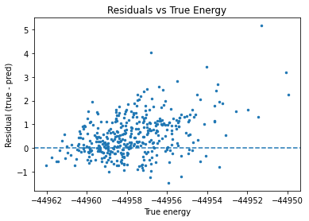

# High-Dimensional Neural Network Potential for the Malonaldehyde Molecule  
**Brandon-Lee De Bruyn**

---

## Introduction

This project implements a **second-generation high-dimensional neural network potential (HDNNP)** as proposed by Behler–Parrinello, where molecular energies are represented as sums of element-specific atomic contributions predicted from local, symmetry-preserving descriptors [1,2]. A structural overview of the second-generation HDNNP pipeline is shown below.

  

**Figure 1.** Second-generation HDNNP structure: Cartesian coordinates  
$\mathbf{R}_i^\mu \rightarrow \mathbf{G}_i^\mu \rightarrow \text{atomic NNs} \rightarrow E$

---

## Data Curation

For efficient training, data splitting was performed at the **frame (molecule) level**. Unique frames were partitioned using a **90/10 split** (`val_size = 0.1`, `random_state = 42`), yielding:

- **Training:** 16,200  
- **Validation:** 1,800  
- **Test:** 3,600  

---

## Atom-Centered Symmetry Functions (ACSFs)

Each atomic environment was encoded using **radial and angular ACSFs**, ensuring invariance under translation, rotation, and permutation of identical atoms [1,2]. All symmetry functions use the cosine cutoff [2]:

$$
f_c(R_{ij}) =
\begin{cases}
\frac{1}{2}\left[\cos\left(\pi \frac{R_{ij}}{R_{\text{cut}}}\right)+1\right], & R_{ij} \le R_{\text{cut}} \\
0, & R_{ij} > R_{\text{cut}}
\end{cases}
$$

with $R_{\text{cut}} = 5.5$ and $R_{ij} = \lVert \mathbf{R}_j - \mathbf{R}_i \rVert$.

---

### Element-Resolved Radial Functions

Radial ACSFs describe the distribution of neighboring atoms around a central atom:

$$
G^{\text{rad}}_{i,m} =
\sum_{j \ne i}
\exp\left[-\eta_m (R_{ij}-R_s)^2\right] f_c(R_{ij})
$$

**Parameter grid**
- $\eta \in \{0.05,\;0.5,\;1.0,\;2.0,\;4.0,\;8.0\}$
- $R_s \in \text{linspace}(0, R_{\text{cut}}, 8)$

This gives:

$$
6 \times 8 = 48 \quad \text{radial functions per element}
$$

With three elements (C, H, O):

$$
3 \times 48 = 144 \quad \text{radial features per atom}
$$

---

### Element-Pair-Resolved Angular Functions

Angular ACSFs encode three-body correlations:

$$
G^{\text{ang}}_{i,m} =
2^{1-\zeta_m}
\sum_{j<k}
(1+\lambda_m \cos\theta_{ijk})^{\zeta_m}
\exp\left[-\eta_m (R_{ij}^2+R_{ik}^2+R_{jk}^2)\right]
f_c(R_{ij})f_c(R_{ik})
$$

**Parameter grid**
- $\eta \in \{0.0005,\;0.005\}$
- $\zeta \in \{1,\;2,\;4\}$
- $\lambda \in \{-1,\;1\}$

This yields:

$$
2 \times 3 \times 2 = 12 \quad \text{angular functions per element pair}
$$

With six unordered element pairs:

$$
6 \times 12 = 72 \quad \text{angular features per atom}
$$

---

### Final Descriptor Dimension

$$
D = 144 + 72 = 216
$$

---

## Model Design and Training

Each atom is processed by an element-specific neural network, and atomic energies are summed:

$$
\hat{E} =
\sum_{i=1}^{N} \hat{E}_i
=
\sum_{\mu}\sum_{i \in \mu}
\text{NN}_{\mu}(\mathbf{G}_i^\mu)
$$

Three atomic networks were constructed (C, H, O), each with:

- Input dimension: $D = 216$
- Two hidden layers (64 neurons)
- $\tanh$ activation
- Linear output

---

### Regularization

To improve generalization:
- **L2 weight decay** with $\lambda = 10^{-6}$
- **Dropout** with rate 0.05 after each hidden layer [3]

---

### Normalization and Optimization

Standardization applied using training statistics:

$$
X' = \frac{X - \mu_X}{\sigma_X},
\qquad
y' = \frac{y - \mu_y}{\sigma_y}
$$

Training details:
- Loss: MSE
- Optimizer: Adam [4]
- Learning rate: $10^{-4}$
- Batch size: 32
- Early stopping and learning-rate reduction

  

**Figure 2.** Training and validation loss.

---

## Testing and Results

Evaluation metrics:

$$
\text{MAE} = \frac{1}{F}\sum_f |\hat{y}_f - y_f|,
\qquad
\text{RMSE} = \sqrt{\frac{1}{F}\sum_f (\hat{y}_f - y_f)^2}
$$

Final test performance:
- **MAE:** 0.737  
- **RMSE:** 0.996  
- **$R^2$:** 0.721  

   
  

**Figure 3.**  
(Top) Predicted vs. true energies.  
(Bottom) Residuals (true − predicted).

The results demonstrate that an ACSF-based second-generation HDNNP captures the dominant structure of the malonaldehyde energy landscape.

---

## References

1. Behler, J., & Parrinello, M. *Phys. Rev. Lett.* **98**, 146401 (2007)  
2. Behler, J. *Chem. Rev.* **121**, 10037–10072 (2021)  
3. Hinton, G. et al. *Improving neural networks by preventing co-adaptation* (2012)  
4. Kingma, D. P., & Ba, J. *Adam: A method for stochastic optimization* (2014)
